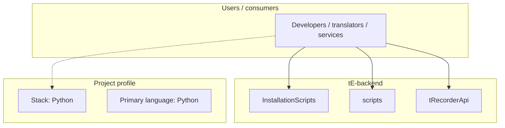
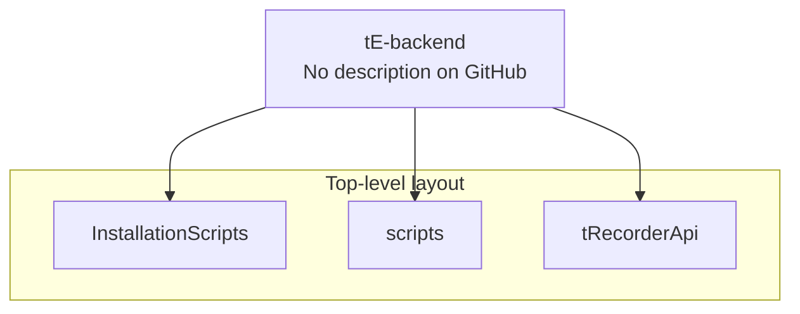
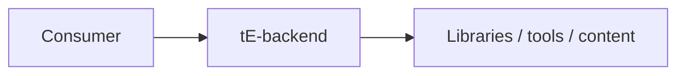

# tE-backend architecture

[WycliffeAssociates/tE-backend](https://github.com/WycliffeAssociates/tE-backend) — _no GitHub description_.

moved to https://github.com/Bible-Translation-Tools/BTT-Exchanger

## System context

## Repository structure

**Directories:** `InstallationScripts`, `scripts`, `tRecorderApi`

**Notable files:** `.gitignore`, `.travis.yml`, `__init__.py`, `api_spec.txt`, `postgres-setup`, `README.md`, `sonar-project.properties`

## Runtime / integration sketch

> This diagram is inferred from repository layout, languages, and README. It is a starting map, not a full design review.

## Languages

| Language | Approx. file count |
|----------|-------------------|
| Python | 98 files |
| Shell | 7 files |
| YAML | 5 files |
| HTML | 1 files |
| JavaScript | 1 files |

## Design notes

| Topic | Detail |
|--------|--------|
| **Stack** | Python |
| **Default branch** | `master` |
| **Org** | WycliffeAssociates |

## Related

- Source: [WycliffeAssociates/tE-backend](https://github.com/WycliffeAssociates/tE-backend)
- Branch analyzed: `master`
