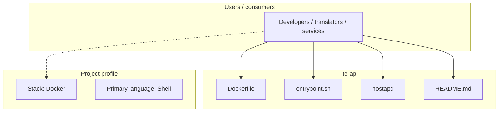
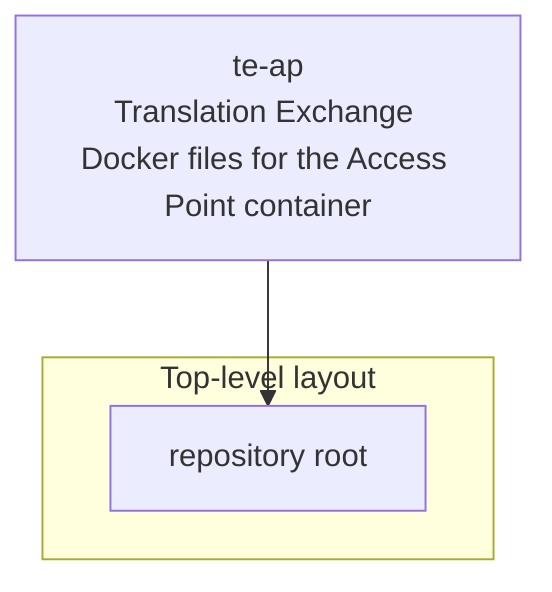
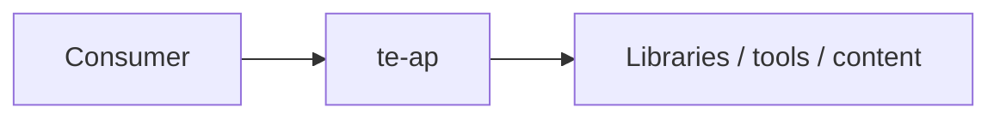

# te-ap architecture

[WycliffeAssociates/te-ap](https://github.com/WycliffeAssociates/te-ap) — Translation Exchange Docker files for the Access Point container.

moved to https://github.com/Bible-Translation-Tools/BTT-Exchanger

## System context

## Repository structure

**Notable files:** `Dockerfile`, `entrypoint.sh`, `hostapd`, `README.md`

## Runtime / integration sketch

> This diagram is inferred from repository layout, languages, and README. It is a starting map, not a full design review.

## Languages

| Language | Approx. file count |
|----------|-------------------|
| Shell | 1 files |

## Design notes

| Topic | Detail |
|--------|--------|
| **Stack** | Docker |
| **Default branch** | `master` |
| **Org** | WycliffeAssociates |

## Related

- Source: [WycliffeAssociates/te-ap](https://github.com/WycliffeAssociates/te-ap)
- Branch analyzed: `master`
