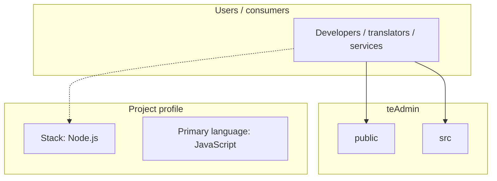
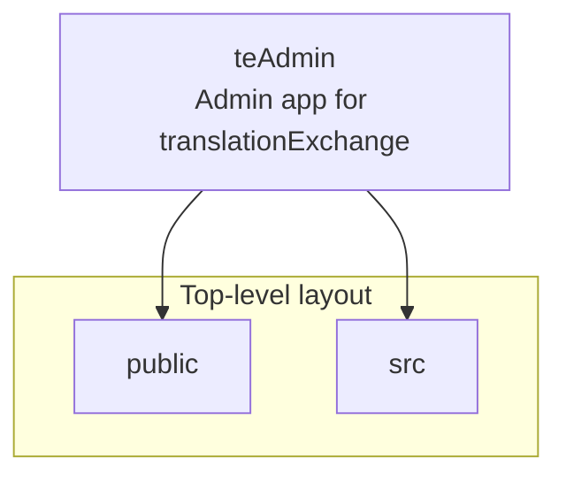
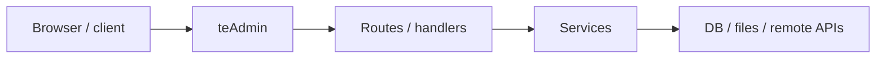

# teAdmin architecture

[WycliffeAssociates/teAdmin](https://github.com/WycliffeAssociates/teAdmin) — Admin app for translationExchange.

moved to https://github.com/Bible-Translation-Tools/BTT-Exchanger

## System context

## Repository structure

**Directories:** `public`, `src`

**Notable files:** `.gitignore`, `.travis.yml`, `extra-setup.sh`, `package.json`, `Procfile`, `README.md`, `sonar-project.properties`

## Runtime / integration sketch

> This diagram is inferred from repository layout, languages, and README. It is a starting map, not a full design review.

## Languages

| Language | Approx. file count |
|----------|-------------------|
| JavaScript | 66 files |
| CSS | 4 files |
| Shell | 3 files |
| YAML | 2 files |
| HTML | 1 files |

## Design notes

| Topic | Detail |
|--------|--------|
| **Stack** | Node.js |
| **Default branch** | `master` |
| **Org** | WycliffeAssociates |

## Related

- Source: [WycliffeAssociates/teAdmin](https://github.com/WycliffeAssociates/teAdmin)
- Branch analyzed: `master`
