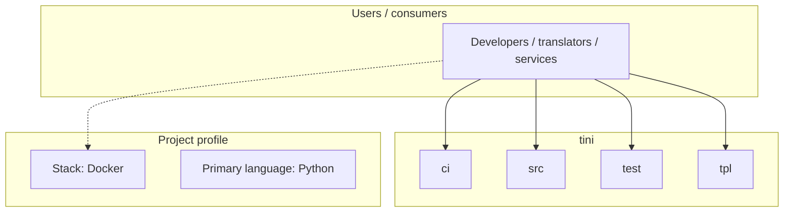
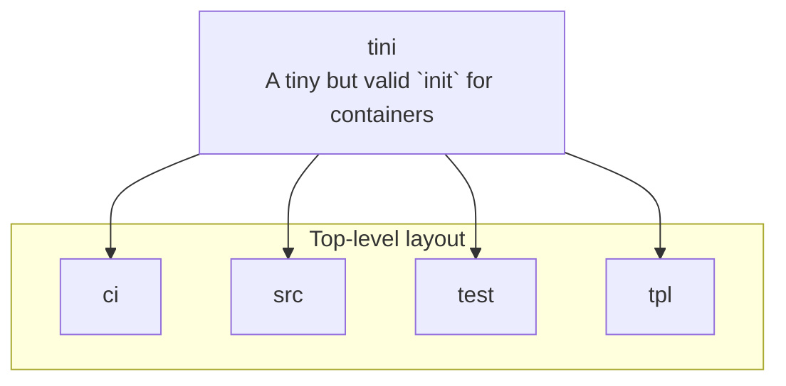

# tini architecture

[WycliffeAssociates/tini](https://github.com/WycliffeAssociates/tini) — A tiny but valid `init` for containers.

-->

## System context

## Repository structure

**Directories:** `ci`, `src`, `test`, `tpl`

**Notable files:** `.dockerignore`, `.gitignore`, `.travis.yml`, `CMakeLists.txt`, `ddist.sh`, `Dockerfile`, `dtest.sh`, `LICENSE`, `README.md`, `run_tests.sh`, `sign.key.enc`

## Runtime / integration sketch

> This diagram is inferred from repository layout, languages, and README. It is a starting map, not a full design review.

## Languages

| Language | Approx. file count |
|----------|-------------------|
| Python | 7 files |
| Shell | 5 files |
| C | 3 files |

## Design notes

| Topic | Detail |
|--------|--------|
| **Stack** | Docker |
| **Default branch** | `master` |
| **Org** | WycliffeAssociates |

## Related

- Source: [WycliffeAssociates/tini](https://github.com/WycliffeAssociates/tini)
- Branch analyzed: `master`
