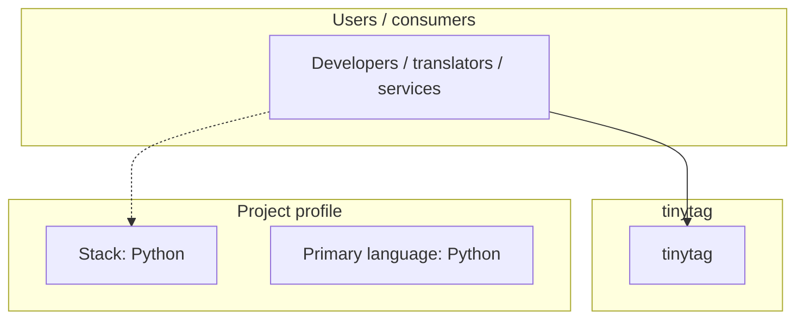
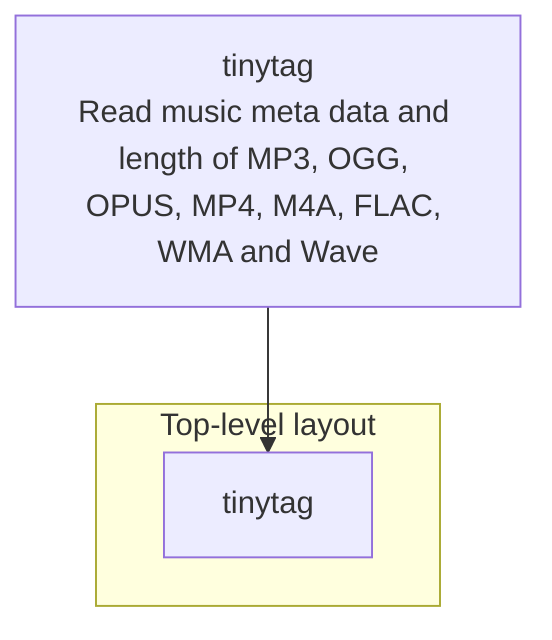
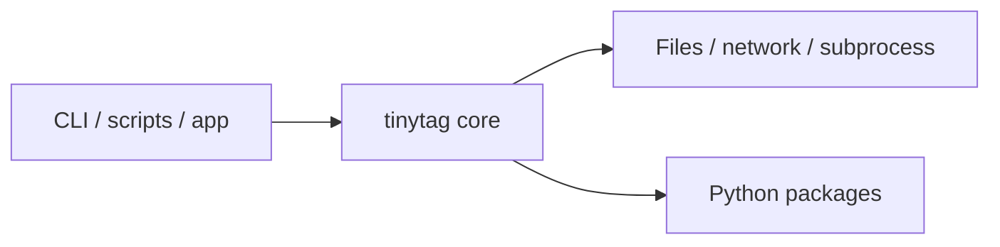

# tinytag architecture

[WycliffeAssociates/tinytag](https://github.com/WycliffeAssociates/tinytag) — Read music meta data and length of MP3, OGG, OPUS, MP4, M4A, FLAC, WMA and Wave files with python 2 or 3.

tinytag =======

## System context

## Repository structure

**Directories:** `tinytag`

**Notable files:** `.gitignore`, `.travis.yml`, `LICENSE`, `MANIFEST.in`, `README.md`, `runtests.py`, `setup.py`

## Runtime / integration sketch

> This diagram is inferred from repository layout, languages, and README. It is a starting map, not a full design review.

## Languages

| Language | Approx. file count |
|----------|-------------------|
| Python | 6 files |

## Design notes

| Topic | Detail |
|--------|--------|
| **Stack** | Python |
| **Default branch** | `master` |
| **Org** | WycliffeAssociates |

## Related

- Source: [WycliffeAssociates/tinytag](https://github.com/WycliffeAssociates/tinytag)
- Branch analyzed: `master`
