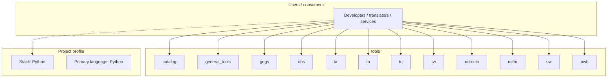
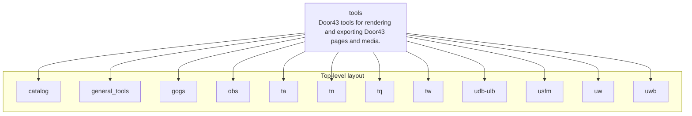
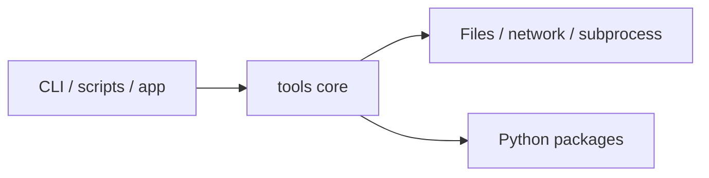

# tools architecture

[WycliffeAssociates/tools](https://github.com/WycliffeAssociates/tools) — Door43 tools for rendering and exporting Door43 pages and media..

* git_wrapper.py * smartquotes.pu * update_catalog.py

## System context

## Repository structure

**Directories:** `catalog`, `general_tools`, `gogs`, `obs`, `ta`, `tn`, `tq`, `tw`, `udb-ulb`, `usfm`, `uw`, `uwb`

**Notable files:** `.gitignore`, `__init__.py`, `LICENSE`, `Makefile`, `README.md`, `requirements.txt`, `tex_bootstrap.sh`

## Runtime / integration sketch

> This diagram is inferred from repository layout, languages, and README. It is a starting map, not a full design review.

## Languages

| Language | Approx. file count |
|----------|-------------------|
| Python | 131 files |
| Shell | 75 files |
| HTML | 9 files |
| XSLT | 5 files |
| CSS | 4 files |
| PHP | 1 files |
| Batch | 1 files |

## Design notes

| Topic | Detail |
|--------|--------|
| **Stack** | Python |
| **Default branch** | `master` |
| **Org** | WycliffeAssociates |

## Related

- Source: [WycliffeAssociates/tools](https://github.com/WycliffeAssociates/tools)
- Branch analyzed: `master`
