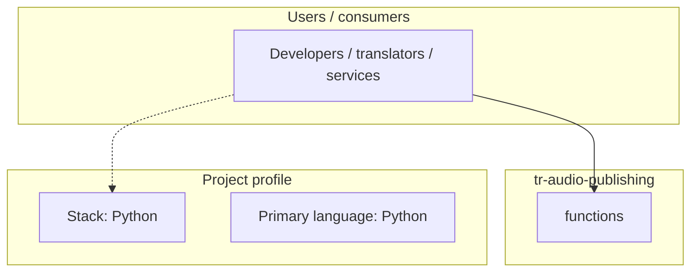
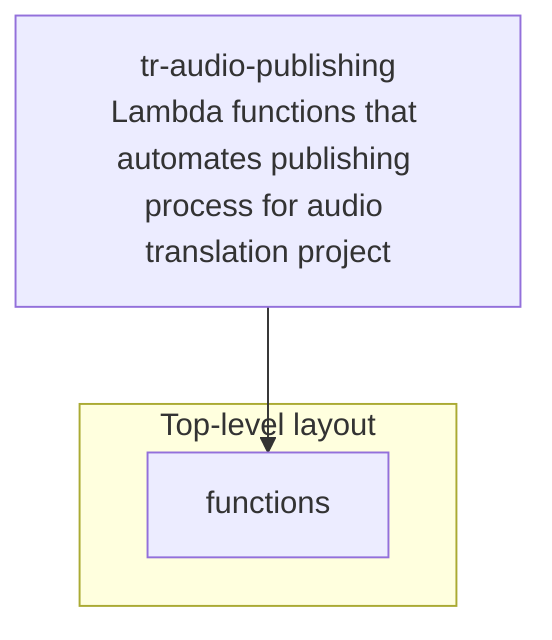
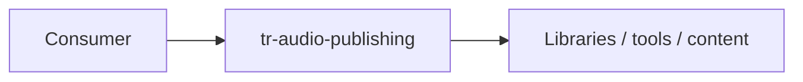

# tr-audio-publishing architecture

[WycliffeAssociates/tr-audio-publishing](https://github.com/WycliffeAssociates/tr-audio-publishing) — Lambda functions that automates publishing process for audio translation projects.

*In testing/prototype phase*

## System context

## Repository structure

**Directories:** `functions`

**Notable files:** `project.json`, `README.md`

## Runtime / integration sketch

> This diagram is inferred from repository layout, languages, and README. It is a starting map, not a full design review.

## Languages

| Language | Approx. file count |
|----------|-------------------|
| Python | 2 files |

## Design notes

| Topic | Detail |
|--------|--------|
| **Stack** | Python |
| **Default branch** | `master` |
| **Org** | WycliffeAssociates |

## Related

- Source: [WycliffeAssociates/tr-audio-publishing](https://github.com/WycliffeAssociates/tr-audio-publishing)
- Branch analyzed: `master`
