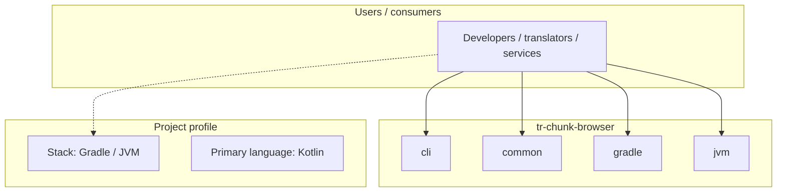
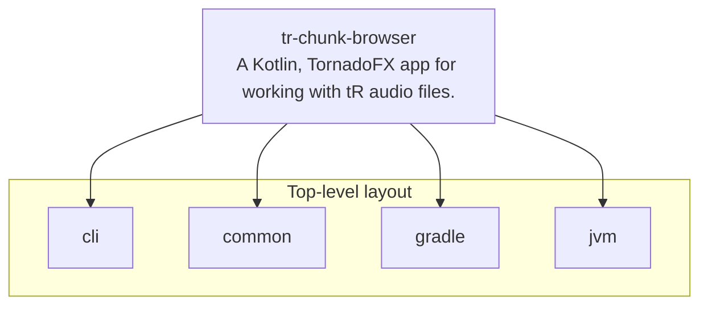
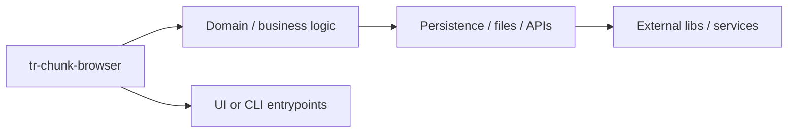

# tr-chunk-browser architecture

[WycliffeAssociates/tr-chunk-browser](https://github.com/WycliffeAssociates/tr-chunk-browser) — A Kotlin, TornadoFX app for working with tR audio files..

This application can import and identify verses within tR audio file chunks. After importing tR audio files containing verses, you may selectively split verses into separate files and merge verses into a chunk audio file, all while maintaining the tR metadata.

## System context

## Repository structure

**Directories:** `cli`, `common`, `gradle`, `jvm`

**Notable files:** `.gitignore`, `.travis.yml`, `build.gradle`, `crowdin.yml`, `dependencies.gradle`, `gradle.properties`, `gradlew`, `gradlew.bat`, `launcher.ico`, `LICENSE`, `README.md`, `settings.gradle`

## Runtime / integration sketch

> This diagram is inferred from repository layout, languages, and README. It is a starting map, not a full design review.

## Languages

| Language | Approx. file count |
|----------|-------------------|
| Kotlin | 33 files |
| Gradle | 6 files |
| YAML | 1 files |
| Batch | 1 files |

## Design notes

| Topic | Detail |
|--------|--------|
| **Stack** | Gradle / JVM |
| **Default branch** | `master` |
| **Org** | WycliffeAssociates |

## Related

- Source: [WycliffeAssociates/tr-chunk-browser](https://github.com/WycliffeAssociates/tr-chunk-browser)
- Branch analyzed: `master`
