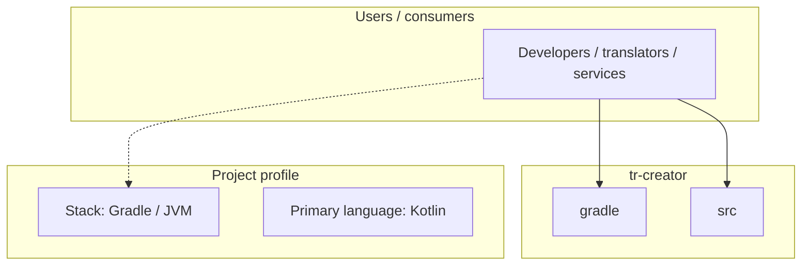
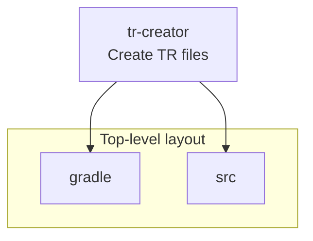
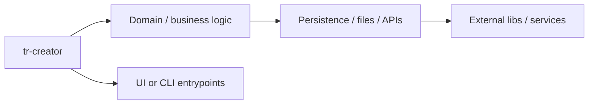

# tr-creator architecture

[WycliffeAssociates/tr-creator](https://github.com/WycliffeAssociates/tr-creator) — Create TR files.

Create TR files from BTT Recorder projects

## System context

## Repository structure

**Directories:** `gradle`, `src`

**Notable files:** `.gitignore`, `build.gradle`, `crowdin.yml`, `gradle.properties`, `gradlew`, `gradlew.bat`, `launcher.ico`, `LICENSE`, `README.md`, `settings.gradle`

## Runtime / integration sketch

> This diagram is inferred from repository layout, languages, and README. It is a starting map, not a full design review.

## Languages

| Language | Approx. file count |
|----------|-------------------|
| Kotlin | 9 files |
| Gradle | 2 files |
| YAML | 1 files |
| Batch | 1 files |

## Design notes

| Topic | Detail |
|--------|--------|
| **Stack** | Gradle / JVM |
| **Default branch** | `master` |
| **Org** | WycliffeAssociates |

## Related

- Source: [WycliffeAssociates/tr-creator](https://github.com/WycliffeAssociates/tr-creator)
- Branch analyzed: `master`
