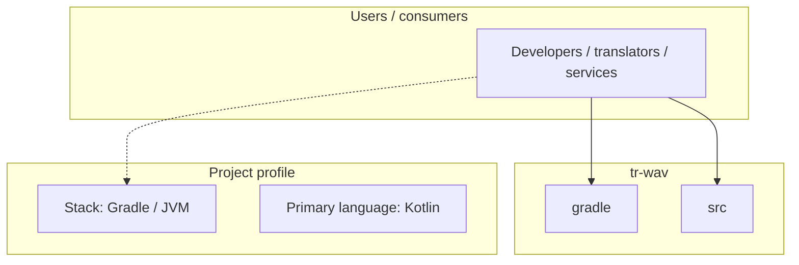
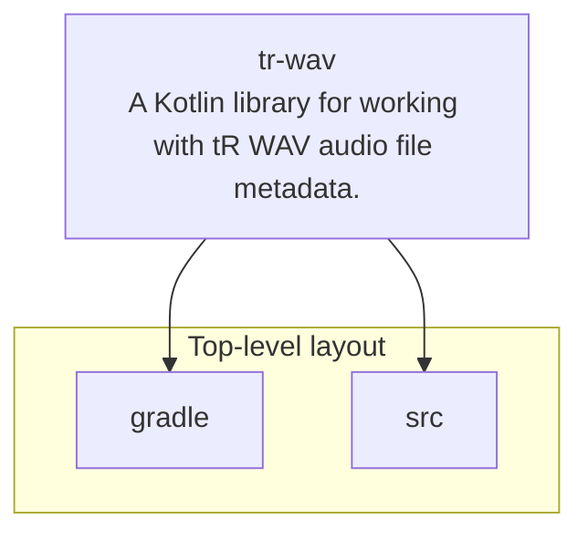
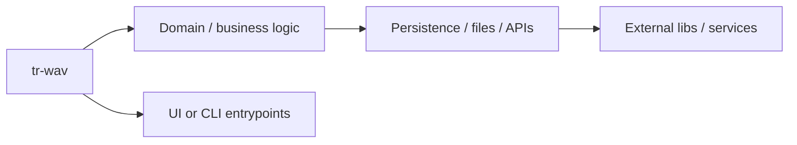

# tr-wav architecture

[WycliffeAssociates/tr-wav](https://github.com/WycliffeAssociates/tr-wav) — A Kotlin library for working with tR WAV audio file metadata..

A Kotlin library for working with tR WAV audio file metadata. Ported from the [BTT Recorder Android app](https://github.com/Bible-Translation-Tools/BTT-Recorder/tree/dev/translationRecorder/app/src/main/java/org/wycliffeassociates/translationrecorder/wav).

## System context

## Repository structure

**Directories:** `gradle`, `src`

**Notable files:** `.gitignore`, `.travis.yml`, `build.gradle`, `gradle.properties`, `gradlew`, `gradlew.bat`, `LICENSE`, `README.md`, `settings.gradle`

## Runtime / integration sketch

> This diagram is inferred from repository layout, languages, and README. It is a starting map, not a full design review.

## Languages

| Language | Approx. file count |
|----------|-------------------|
| Kotlin | 17 files |
| Gradle | 2 files |
| Batch | 1 files |

## Design notes

| Topic | Detail |
|--------|--------|
| **Stack** | Gradle / JVM |
| **Default branch** | `master` |
| **Org** | WycliffeAssociates |

## Related

- Source: [WycliffeAssociates/tr-wav](https://github.com/WycliffeAssociates/tr-wav)
- Branch analyzed: `master`
