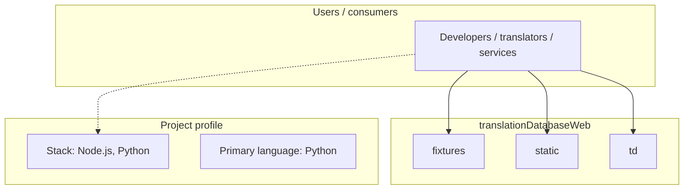
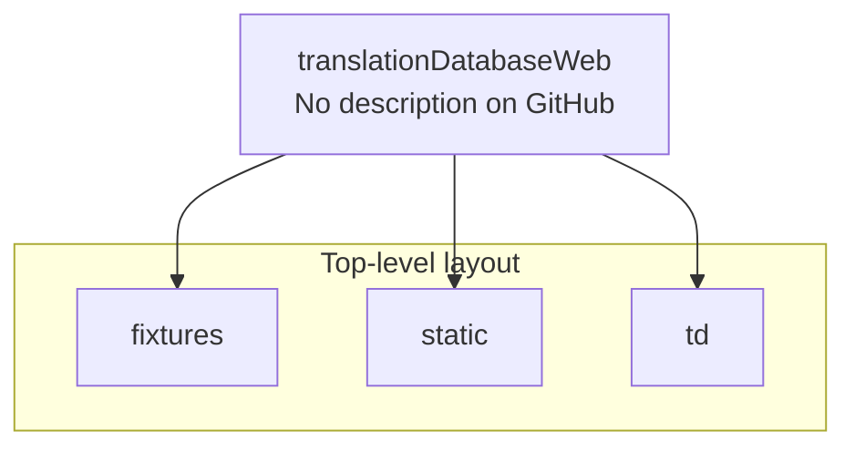
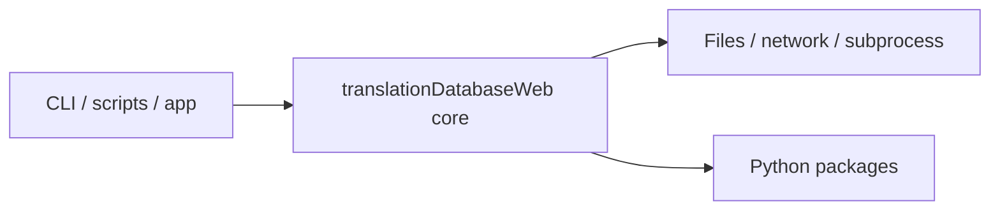

# translationDatabaseWeb architecture

[WycliffeAssociates/translationDatabaseWeb](https://github.com/WycliffeAssociates/translationDatabaseWeb) — _no GitHub description_.

translationDatabase ===================

## System context

## Repository structure

**Directories:** `fixtures`, `static`, `td`

**Notable files:** `.coveragerc`, `.env`, `.gitattributes`, `.gitignore`, `.travis.yml`, `gondor.yml`, `manage.py`, `package.json`, `Procfile`, `readme-dev.md`, `README.md`, `requirements-test.txt`, `requirements.txt`, `rest_api.md`, `tox.ini`

## Runtime / integration sketch

> This diagram is inferred from repository layout, languages, and README. It is a starting map, not a full design review.

## Languages

| Language | Approx. file count |
|----------|-------------------|
| Python | 235 files |
| HTML | 82 files |
| JavaScript | 8 files |
| YAML | 1 files |
| CSS | 1 files |

## Design notes

| Topic | Detail |
|--------|--------|
| **Stack** | Node.js, Python |
| **Default branch** | `master` |
| **Org** | WycliffeAssociates |

## Related

- Source: [WycliffeAssociates/translationDatabaseWeb](https://github.com/WycliffeAssociates/translationDatabaseWeb)
- Branch analyzed: `master`
