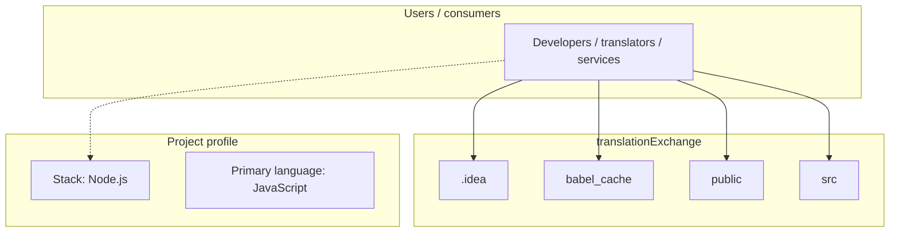
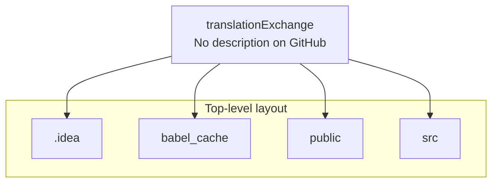
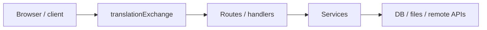

# translationExchange architecture

[WycliffeAssociates/translationExchange](https://github.com/WycliffeAssociates/translationExchange) — _no GitHub description_.

| Branch | Build Status | | --- | --- | | Master |  | | Dev |  |

## System context

## Repository structure

**Directories:** `.idea`, `babel_cache`, `public`, `src`

**Notable files:** `.babelrc`, `.eslintrc`, `.gitignore`, `.travis.yml`, `cert.pem`, `extra-setup.sh`, `key.pem`, `package.json`, `Procfile`, `README.md`, `server.js`, `sonar-project.properties`, `webpack.config.js`

## Runtime / integration sketch

> This diagram is inferred from repository layout, languages, and README. It is a starting map, not a full design review.

## Languages

| Language | Approx. file count |
|----------|-------------------|
| JavaScript | 279 files |
| CSS | 12 files |
| Shell | 3 files |
| YAML | 2 files |
| HTML | 1 files |

## Design notes

| Topic | Detail |
|--------|--------|
| **Stack** | Node.js |
| **Default branch** | `master` |
| **Org** | WycliffeAssociates |

## Related

- Source: [WycliffeAssociates/translationExchange](https://github.com/WycliffeAssociates/translationExchange)
- Branch analyzed: `master`
