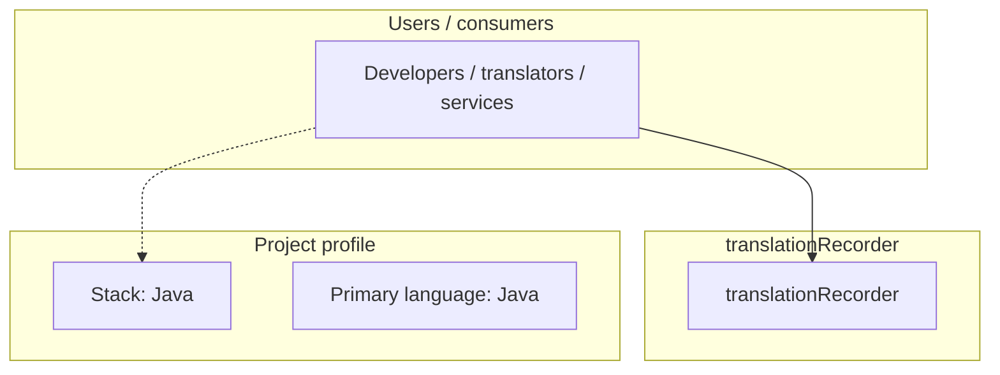
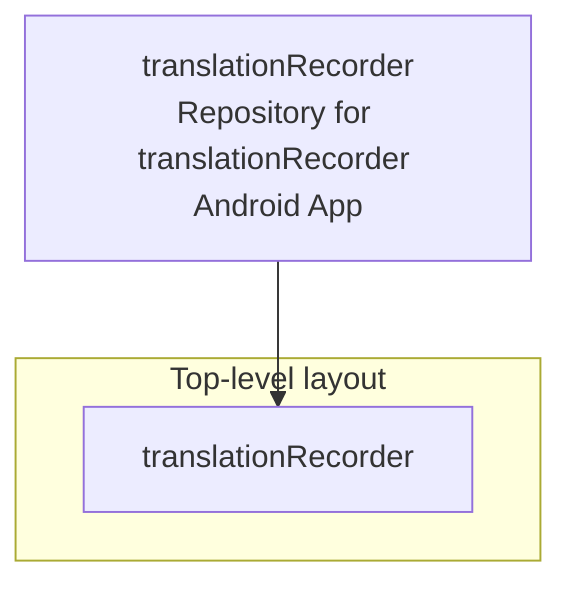
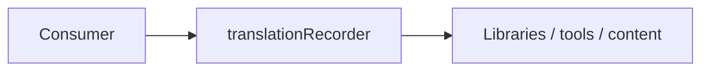

# translationRecorder architecture

[WycliffeAssociates/translationRecorder](https://github.com/WycliffeAssociates/translationRecorder) — Repository for translationRecorder Android App.

Designed to give mother-tongue oral-only translators a tool for recording scripture audio content, translationRecorder focuses on a simple user interface and high quality recording.

## System context

## Repository structure

**Directories:** `translationRecorder`

**Notable files:** `.gitignore`, `LICENSE`, `README.md`

## Runtime / integration sketch

> This diagram is inferred from repository layout, languages, and README. It is a starting map, not a full design review.

## Languages

| Language | Approx. file count |
|----------|-------------------|
| Java | 226 files |
| XML | 218 files |
| Gradle | 14 files |
| Kotlin | 11 files |
| HTML | 6 files |
| Python | 6 files |
| JavaScript | 3 files |
| C | 1 files |

## Design notes

| Topic | Detail |
|--------|--------|
| **Stack** | Java |
| **Default branch** | `export-with-user` |
| **Org** | WycliffeAssociates |

## Related

- Source: [WycliffeAssociates/translationRecorder](https://github.com/WycliffeAssociates/translationRecorder)
- Branch analyzed: `export-with-user`
