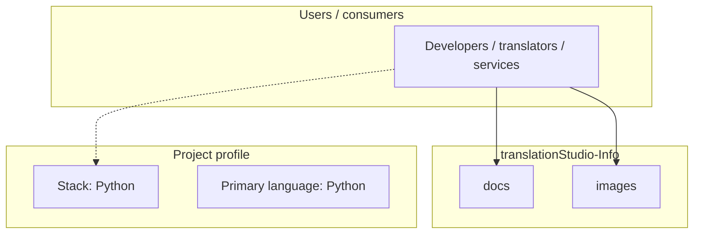
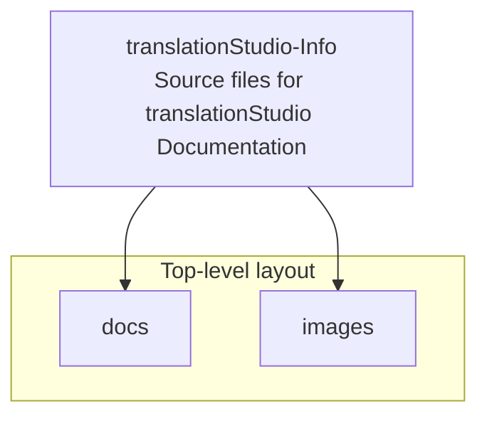
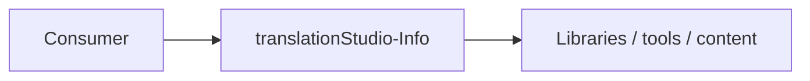

# translationStudio-Info architecture

[WycliffeAssociates/translationStudio-Info](https://github.com/WycliffeAssociates/translationStudio-Info) — Source files for translationStudio Documentation.

See https://translationstudio-info.readthedocs.io/en/latest/ for the documentation, this repo is the source files.

## System context

## Repository structure

**Directories:** `docs`, `images`

**Notable files:** `.gitignore`, `AtS_Navigation_Handout.pdf`, `LICENSE`, `README.md`

## Runtime / integration sketch

> This diagram is inferred from repository layout, languages, and README. It is a starting map, not a full design review.

## Languages

| Language | Approx. file count |
|----------|-------------------|
| Python | 1 files |
| Batch | 1 files |

## Design notes

| Topic | Detail |
|--------|--------|
| **Stack** | Python |
| **Default branch** | `master` |
| **Org** | WycliffeAssociates |

## Related

- Source: [WycliffeAssociates/translationStudio-Info](https://github.com/WycliffeAssociates/translationStudio-Info)
- Branch analyzed: `master`
