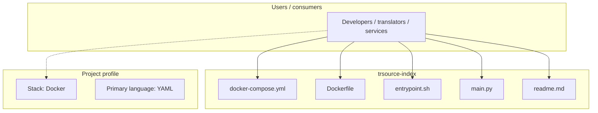
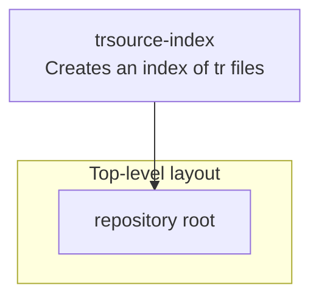

# trsource-index architecture

[WycliffeAssociates/trsource-index](https://github.com/WycliffeAssociates/trsource-index) — Creates an index of tr files.

Create index of tr files

## System context

## Repository structure

**Notable files:** `docker-compose.yml`, `Dockerfile`, `entrypoint.sh`, `main.py`, `readme.md`

## Runtime / integration sketch

> This diagram is inferred from repository layout, languages, and README. It is a starting map, not a full design review.

## Languages

| Language | Approx. file count |
|----------|-------------------|
| YAML | 1 files |
| Shell | 1 files |
| Python | 1 files |

## Design notes

| Topic | Detail |
|--------|--------|
| **Stack** | Docker |
| **Default branch** | `master` |
| **Org** | WycliffeAssociates |

## Related

- Source: [WycliffeAssociates/trsource-index](https://github.com/WycliffeAssociates/trsource-index)
- Branch analyzed: `master`
