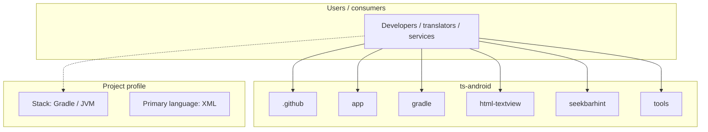
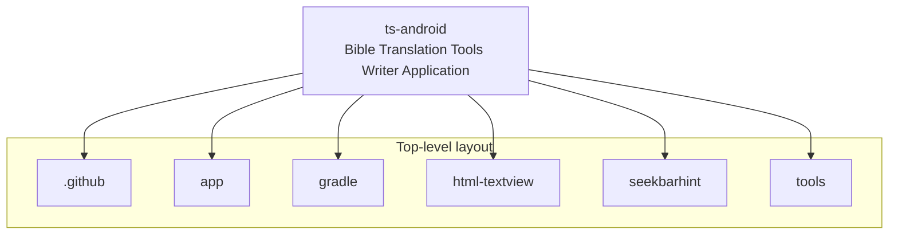
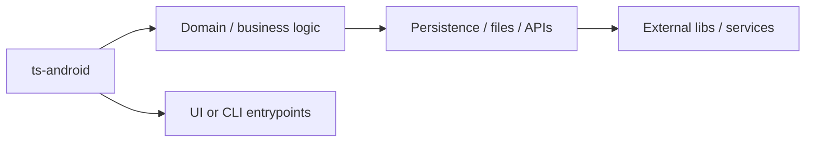

# ts-android architecture

[WycliffeAssociates/ts-android](https://github.com/WycliffeAssociates/ts-android) — Bible Translation Tools Writer Application.

Repo is archived. New repo is here: https://github.com/Bible-Translation-Tools/BTT-Writer-Android

## System context

## Repository structure

**Directories:** `.github`, `app`, `gradle`, `html-textview`, `seekbarhint`, `tools`

**Notable files:** `.gitignore`, `.travis.yml`, `build.gradle`, `COPYING`, `gradle.properties`, `gradlew`, `gradlew.bat`, `LICENSE`, `readme-noto-font.txt`, `README.md`, `secrets.tar.enc`, `settings.gradle`

## Runtime / integration sketch

> This diagram is inferred from repository layout, languages, and README. It is a starting map, not a full design review.

## Languages

| Language | Approx. file count |
|----------|-------------------|
| XML | 303 files |
| Java | 270 files |
| Gradle | 5 files |
| SQL | 1 files |
| Batch | 1 files |

## Design notes

| Topic | Detail |
|--------|--------|
| **Stack** | Gradle / JVM |
| **Default branch** | `master` |
| **Org** | WycliffeAssociates |

## Related

- Source: [WycliffeAssociates/ts-android](https://github.com/WycliffeAssociates/ts-android)
- Branch analyzed: `master`
