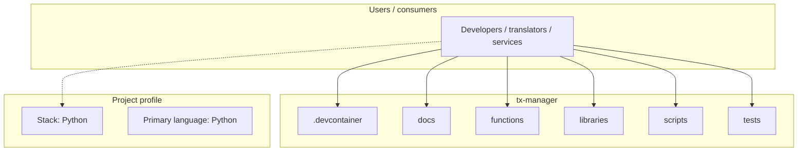
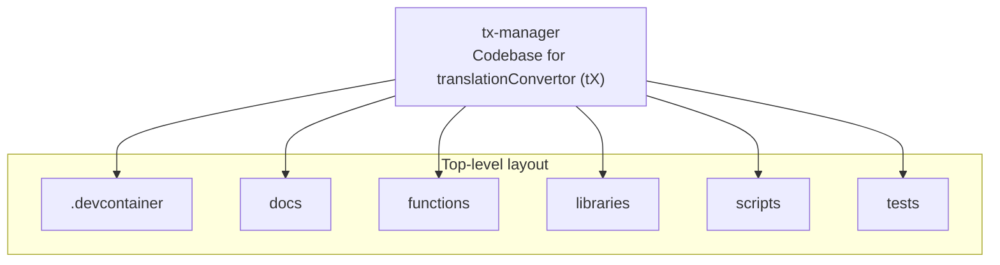
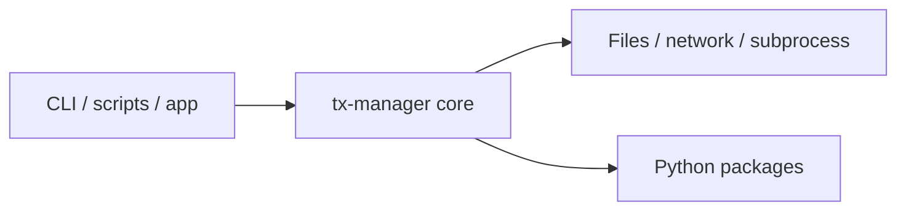

# tx-manager architecture

[WycliffeAssociates/tx-manager](https://github.com/WycliffeAssociates/tx-manager) — Codebase for translationConvertor (tX).

Codebase for translationConvertor (tX)

## System context

## Repository structure

**Directories:** `.devcontainer`, `docs`, `functions`, `libraries`, `scripts`, `tests`

**Notable files:** `.coveragerc`, `.gitignore`, `.travis.yml`, `LICENSE`, `project.develop.json`, `project.master.json`, `project.poc.json`, `project.test.json`, `README.rst`, `requirements.txt`, `setup.py`, `test-setup.py`

## Runtime / integration sketch

> This diagram is inferred from repository layout, languages, and README. It is a starting map, not a full design review.

## Languages

| Language | Approx. file count |
|----------|-------------------|
| Python | 226 files |
| Shell | 5 files |
| HTML | 2 files |
| YAML | 2 files |
| Batch | 1 files |
| JavaScript | 1 files |
| PHP | 1 files |

## Design notes

| Topic | Detail |
|--------|--------|
| **Stack** | Python |
| **Default branch** | `develop` |
| **Org** | WycliffeAssociates |

## Related

- Source: [WycliffeAssociates/tx-manager](https://github.com/WycliffeAssociates/tx-manager)
- Branch analyzed: `develop`
