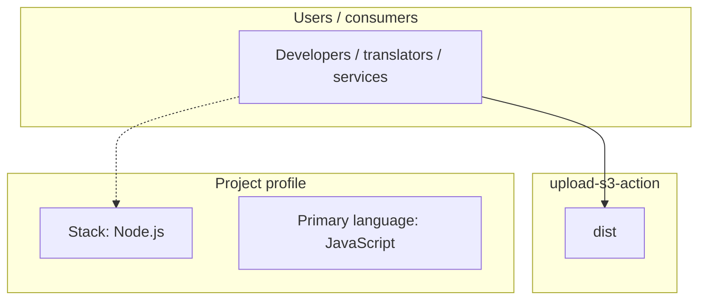
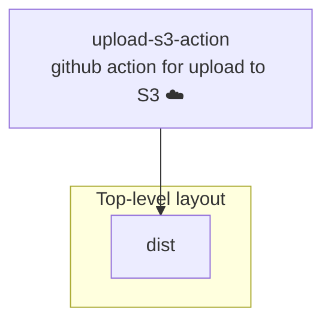
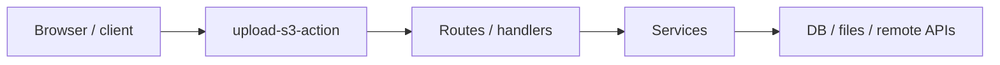

# upload-s3-action architecture

[WycliffeAssociates/upload-s3-action](https://github.com/WycliffeAssociates/upload-s3-action) — github action for upload to S3 ☁️.

This action upload directory to AWS S3 by [public read](https://docs.aws.amazon.com/AmazonS3/latest/dev/WebsiteAccessPermissionsReqd.html) and output key that generated by [shortid](https://github.com/dylang/shortid)

## System context

## Repository structure

**Directories:** `dist`

**Notable files:** `.gitignore`, `action.yml`, `index.js`, `package.json`, `README.md`, `yarn.lock`

## Runtime / integration sketch

> This diagram is inferred from repository layout, languages, and README. It is a starting map, not a full design review.

## Languages

| Language | Approx. file count |
|----------|-------------------|
| JavaScript | 2 files |
| YAML | 1 files |

## Design notes

| Topic | Detail |
|--------|--------|
| **Stack** | Node.js |
| **Default branch** | `master` |
| **Org** | WycliffeAssociates |

## Related

- Source: [WycliffeAssociates/upload-s3-action](https://github.com/WycliffeAssociates/upload-s3-action)
- Branch analyzed: `master`
