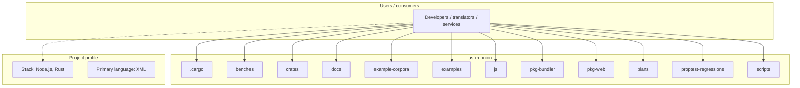
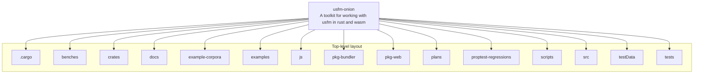
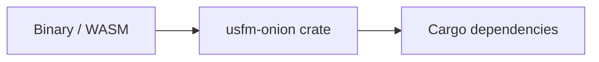

# usfm-onion architecture

[WycliffeAssociates/usfm-onion](https://github.com/WycliffeAssociates/usfm-onion) — A toolkit for working with usfm in rust and wasm.

`usfm_onion` is a Rust-first USFM engine built around one canonical working model: flat tokens.

## System context

## Repository structure

**Directories:** `.cargo`, `benches`, `crates`, `docs`, `example-corpora`, `examples`, `js`, `pkg-bundler`, `pkg-web`, `plans`, `proptest-regressions`, `scripts`, `src`, `testData`, `tests`

**Notable files:** `.gitattributes`, `.gitignore`, `BENCH_RESULTS.md`, `BENCH_RESULTS_WASM.md`, `Cargo.lock`, `Cargo.toml`, `CLAUDE.md`, `clippy.toml`, `package-lock.json`, `package.json`, `perf-notes.md`, `README.md`, `tsconfig.packed-fixture.json`, `vision.md`

## Runtime / integration sketch

> This diagram is inferred from repository layout, languages, and README. It is a starting map, not a full design review.

## Languages

| Language | Approx. file count |
|----------|-------------------|
| XML | 529 files |
| Rust | 95 files |
| HTML | 15 files |
| TypeScript | 8 files |
| YAML | 6 files |
| JavaScript | 6 files |
| Python | 2 files |

## Design notes

| Topic | Detail |
|--------|--------|
| **Stack** | Node.js, Rust |
| **Default branch** | `master` |
| **Org** | WycliffeAssociates |

## Related

- Source: [WycliffeAssociates/usfm-onion](https://github.com/WycliffeAssociates/usfm-onion)
- Branch analyzed: `master`
