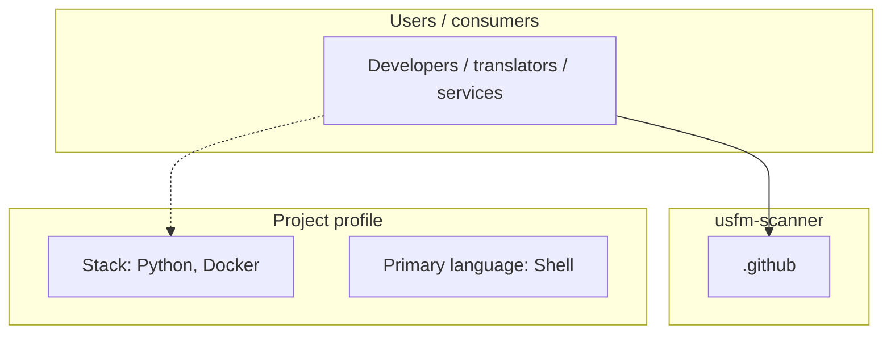
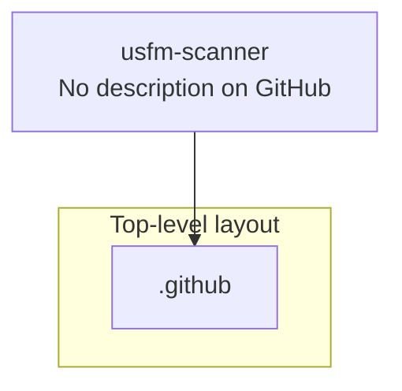
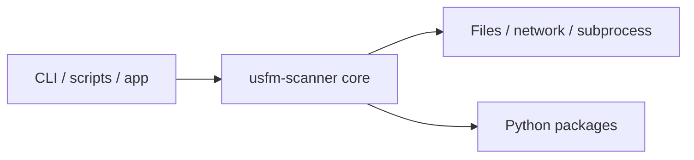

# usfm-scanner architecture

[WycliffeAssociates/usfm-scanner](https://github.com/WycliffeAssociates/usfm-scanner) — _no GitHub description_.

Deprecated in favor of https://github.com/WycliffeAssociates/USFMScannerNet

## System context

## Repository structure

**Directories:** `.github`

**Notable files:** `.gitignore`, `.gitmodules`, `build_push.sh`, `docker-compose.yml`, `Dockerfile`, `entry.sh`, `ErrorCodes.csv`, `LICENSE`, `listener.py`, `README.md`, `requirements.txt`, `usfmtools`

## Runtime / integration sketch

> This diagram is inferred from repository layout, languages, and README. It is a starting map, not a full design review.

## Languages

| Language | Approx. file count |
|----------|-------------------|
| Shell | 2 files |
| YAML | 1 files |
| Python | 1 files |

## Design notes

| Topic | Detail |
|--------|--------|
| **Stack** | Python, Docker |
| **Default branch** | `master` |
| **Org** | WycliffeAssociates |

## Related

- Source: [WycliffeAssociates/usfm-scanner](https://github.com/WycliffeAssociates/usfm-scanner)
- Branch analyzed: `master`
