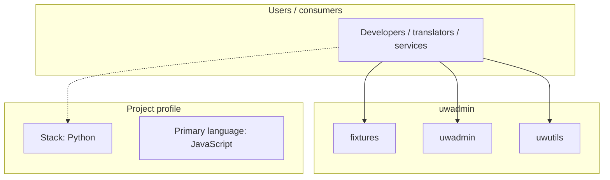
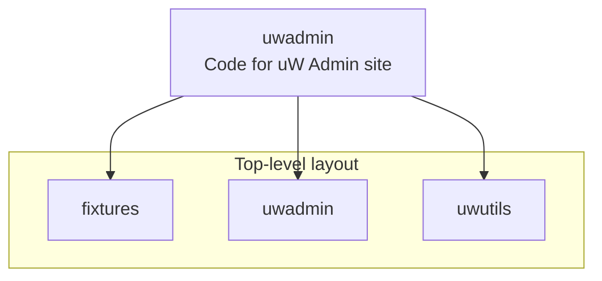
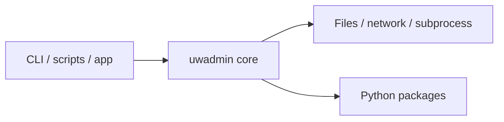

# uwadmin architecture

[WycliffeAssociates/uwadmin](https://github.com/WycliffeAssociates/uwadmin) — Code for uW Admin site.

1. `pip install -r requirements.txt` 2. `./manage.py syncdb` 3. `./manage.py loaddata sites`

## System context

## Repository structure

**Directories:** `fixtures`, `uwadmin`, `uwutils`

**Notable files:** `.gitignore`, `LICENSE`, `manage.py`, `README.md`, `requirements.txt`, `tox.ini`

## Runtime / integration sketch

> This diagram is inferred from repository layout, languages, and README. It is a starting map, not a full design review.

## Languages

| Language | Approx. file count |
|----------|-------------------|
| JavaScript | 49 files |
| Python | 32 files |
| HTML | 23 files |
| CSS | 3 files |
| Shell | 1 files |

## Design notes

| Topic | Detail |
|--------|--------|
| **Stack** | Python |
| **Default branch** | `master` |
| **Org** | WycliffeAssociates |

## Related

- Source: [WycliffeAssociates/uwadmin](https://github.com/WycliffeAssociates/uwadmin)
- Branch analyzed: `master`
