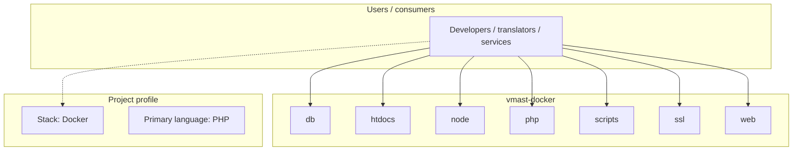
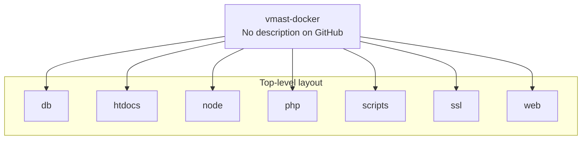

# vmast-docker architecture

[WycliffeAssociates/vmast-docker](https://github.com/WycliffeAssociates/vmast-docker) — _no GitHub description_.

A docker setup for web app with custom configuration

## System context

## Repository structure

**Directories:** `db`, `htdocs`, `node`, `php`, `scripts`, `ssl`, `web`

**Notable files:** `.env.example`, `.gitignore`, `.jshintrc`, `DbDockerfile`, `docker-compose.yml`, `Dockerfile`, `LICENSE`, `node_start.sh`, `NodeDockerfile`, `php_start.sh`, `PhpDockerfile`, `README.md`, `start.sh`

## Runtime / integration sketch

> This diagram is inferred from repository layout, languages, and README. It is a starting map, not a full design review.

## Languages

| Language | Approx. file count |
|----------|-------------------|
| PHP | 937 files |
| JavaScript | 83 files |
| CSS | 13 files |
| Shell | 7 files |
| SQL | 6 files |
| YAML | 2 files |

## Design notes

| Topic | Detail |
|--------|--------|
| **Stack** | Docker |
| **Default branch** | `main` |
| **Org** | WycliffeAssociates |

## Related

- Source: [WycliffeAssociates/vmast-docker](https://github.com/WycliffeAssociates/vmast-docker)
- Branch analyzed: `main`
