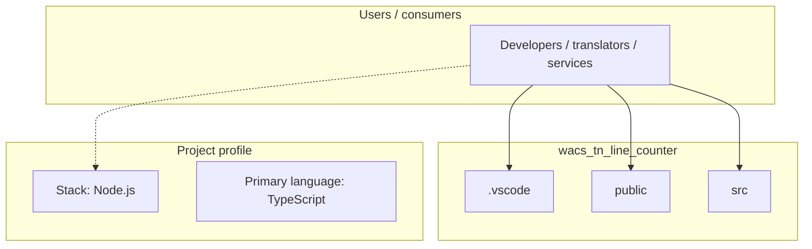
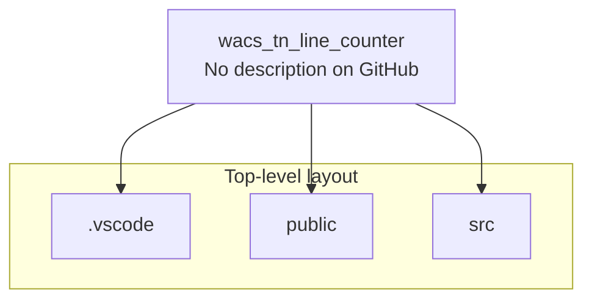
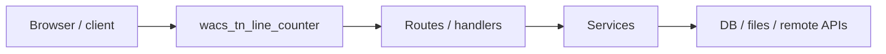

# wacs_tn_line_counter architecture

[WycliffeAssociates/wacs_tn_line_counter](https://github.com/WycliffeAssociates/wacs_tn_line_counter) — _no GitHub description_.

``` npm create astro@latest -- --template basics ```

## System context



## Repository structure



**Directories:** `.vscode`, `public`, `src`

**Notable files:** `.gitignore`, `.npmrc`, `astro.config.ts`, `package-lock.json`, `package.json`, `pnpm-lock.yaml`, `README.md`, `tsconfig.json`


## Runtime / integration sketch



> This diagram is inferred from repository layout, languages, and README. It is a starting map, not a full design review.

## Languages

| Language | Approx. file count |
|----------|-------------------|
| TypeScript | 12 files |
| YAML | 1 files |

## Design notes

| Topic | Detail |
|--------|--------|
| **Stack** | Node.js |
| **Default branch** | `prod` |
| **Org** | WycliffeAssociates |

## Related

- Source: [WycliffeAssociates/wacs_tn_line_counter](https://github.com/WycliffeAssociates/wacs_tn_line_counter)
- Branch analyzed: `prod`
