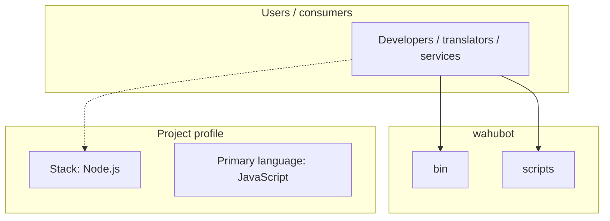
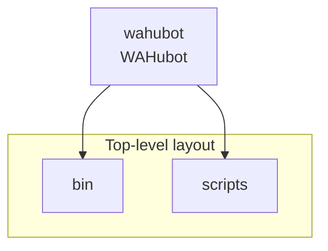
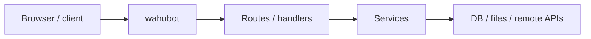

# wahubot architecture

[WycliffeAssociates/wahubot](https://github.com/WycliffeAssociates/wahubot) — WAHubot.

wahubot is a chat bot built on the [Hubot][hubot] framework. It was initially generated by [generator-hubot][generator-hubot], and configured to be deployed on [Heroku][heroku] to get you up and running as quick as possible.

## System context

## Repository structure

**Directories:** `bin`, `scripts`

**Notable files:** `.editorconfig`, `.env`, `.gitignore`, `external-scripts.json`, `external-scripts.json~`, `hubot-scripts.json`, `package.json`, `package.json~`, `Procfile`, `README.md`

## Runtime / integration sketch

> This diagram is inferred from repository layout, languages, and README. It is a starting map, not a full design review.

## Languages

| Language | Approx. file count |
|----------|-------------------|
| JavaScript | 1 files |

## Design notes

| Topic | Detail |
|--------|--------|
| **Stack** | Node.js |
| **Default branch** | `master` |
| **Org** | WycliffeAssociates |

## Related

- Source: [WycliffeAssociates/wahubot](https://github.com/WycliffeAssociates/wahubot)
- Branch analyzed: `master`
