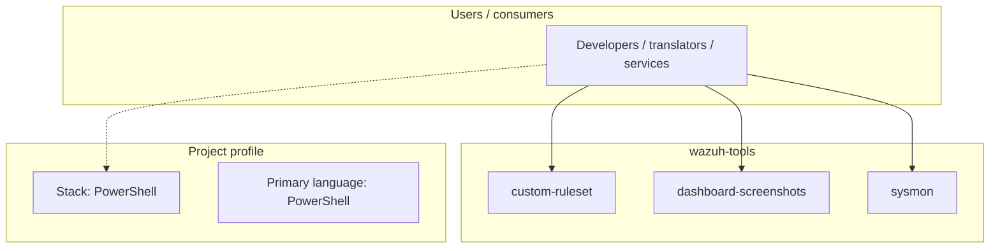
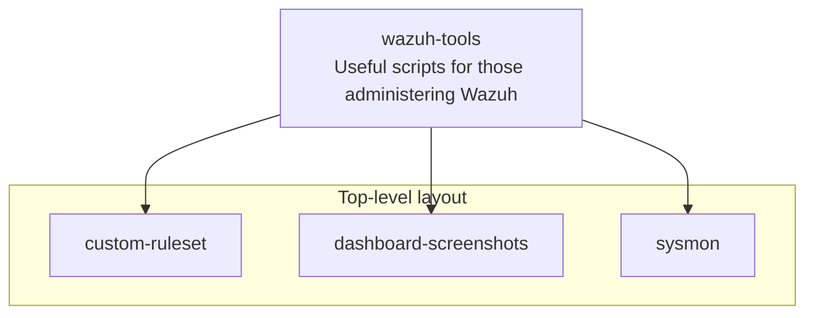

# wazuh-tools architecture

[WycliffeAssociates/wazuh-tools](https://github.com/WycliffeAssociates/wazuh-tools) — Useful scripts for those administering Wazuh.

Useful scripts for those administering Wazuh

## System context

## Repository structure

**Directories:** `custom-ruleset`, `dashboard-screenshots`, `sysmon`

**Notable files:** `bnc-siem-suite.macos`, `bnc-siem-suite.ps1`, `bnc-siem-suite.sh`, `check-osquery.ps1`, `check-osquery.sh`, `check-sysmon.ps1`, `check-wazuh-linux-agent-suite`, `check-wazuh-windows-agent-suite.ps1`, `custom-win-fw-drop`, `deploy-wazuh-amazon-linux-v1-docker-host`, `deploy-wazuh-linux-agent-suite`, `deploy-wazuh-windows-agent-suite.ps1`, `dropcount-analysisd`, `easimulate`, `esquery`, `esquery.ps1`, `extract_windows_full_log_sample`, `flush-sca-state`, `flush-vd-state`, `gen-agent-deploy-local.ps1`

## Runtime / integration sketch

> This diagram is inferred from repository layout, languages, and README. It is a starting map, not a full design review.

## Languages

| Language | Approx. file count |
|----------|-------------------|
| PowerShell | 13 files |
| Shell | 6 files |
| XML | 5 files |

## Design notes

| Topic | Detail |
|--------|--------|
| **Stack** | PowerShell |
| **Default branch** | `master` |
| **Org** | WycliffeAssociates |

## Related

- Source: [WycliffeAssociates/wazuh-tools](https://github.com/WycliffeAssociates/wazuh-tools)
- Branch analyzed: `master`
