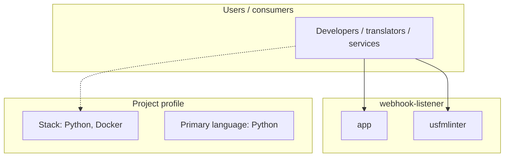
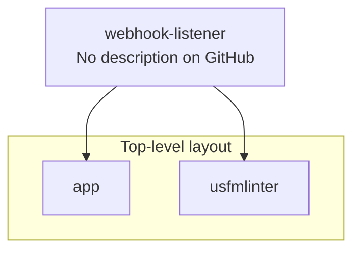
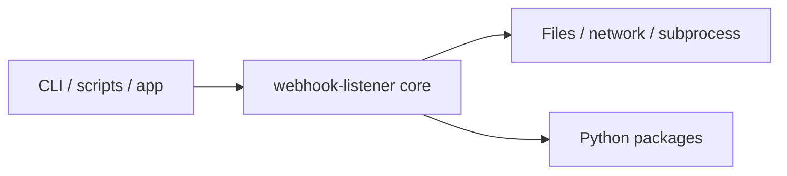

# webhook-listener architecture

[WycliffeAssociates/webhook-listener](https://github.com/WycliffeAssociates/webhook-listener) — _no GitHub description_.

webhook-listener is a public repository under WycliffeAssociates.

## System context

## Repository structure

**Directories:** `app`, `usfmlinter`

**Notable files:** `.dockerignore`, `.gitignore`, `docker-compose.yml`, `Dockerfile`, `json_file_builder.py`, `README.md`, `requirements.txt`

## Runtime / integration sketch

> This diagram is inferred from repository layout, languages, and README. It is a starting map, not a full design review.

## Languages

| Language | Approx. file count |
|----------|-------------------|
| Python | 4 files |
| YAML | 1 files |

## Design notes

| Topic | Detail |
|--------|--------|
| **Stack** | Python, Docker |
| **Default branch** | `dev` |
| **Org** | WycliffeAssociates |

## Related

- Source: [WycliffeAssociates/webhook-listener](https://github.com/WycliffeAssociates/webhook-listener)
- Branch analyzed: `dev`
