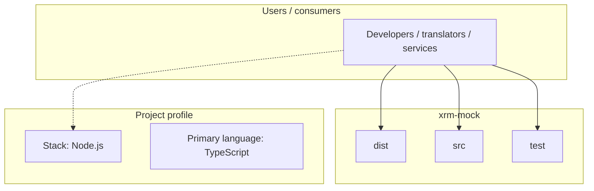
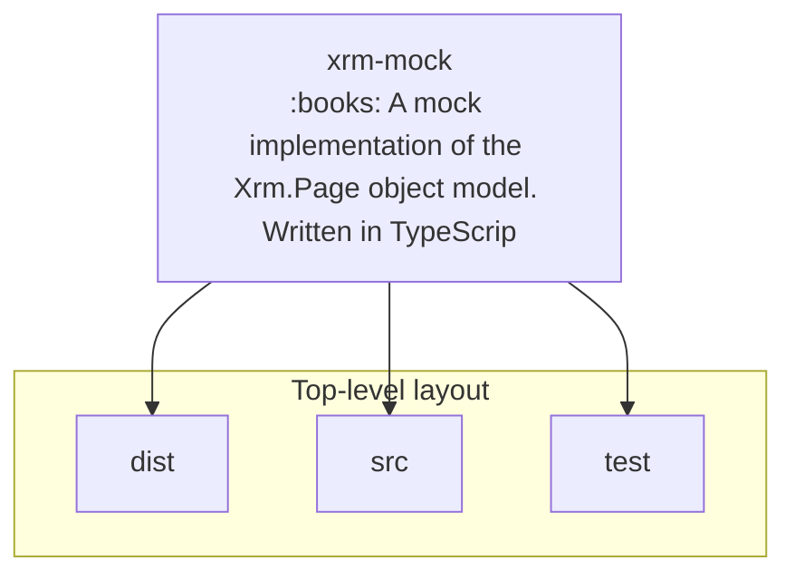
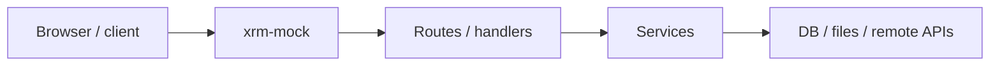

# xrm-mock architecture

[WycliffeAssociates/xrm-mock](https://github.com/WycliffeAssociates/xrm-mock) — :books: A mock implementation of the Xrm.Page object model. Written in TypeScript against @types/xrm definitions..

A mock implementation of the <a href="https://msdn.microsoft.com/en-gb/library/gg328474.aspx">Xrm.Page</a> object model. Written in TypeScript against <a href="https://github.com/DefinitelyTyped/DefinitelyTyped/tree/master/types/xrm">@types/xrm</a> definitions.

## System context

## Repository structure

**Directories:** `dist`, `src`, `test`

**Notable files:** `.gitattributes`, `.gitignore`, `.npmignore`, `.travis.yml`, `gulpfile.js`, `index.d.ts`, `index.js`, `index.ts`, `LICENSE`, `package-lock.json`, `package.json`, `README.md`, `tsconfig.json`, `tslint.json`, `wallaby.js`

## Runtime / integration sketch

> This diagram is inferred from repository layout, languages, and README. It is a starting map, not a full design review.

## Languages

| Language | Approx. file count |
|----------|-------------------|
| TypeScript | 144 files |
| JavaScript | 58 files |

## Design notes

| Topic | Detail |
|--------|--------|
| **Stack** | Node.js |
| **Default branch** | `master` |
| **Org** | WycliffeAssociates |

## Related

- Source: [WycliffeAssociates/xrm-mock](https://github.com/WycliffeAssociates/xrm-mock)
- Branch analyzed: `master`
