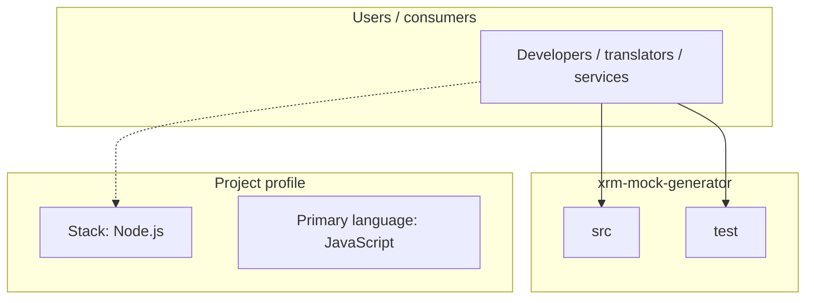
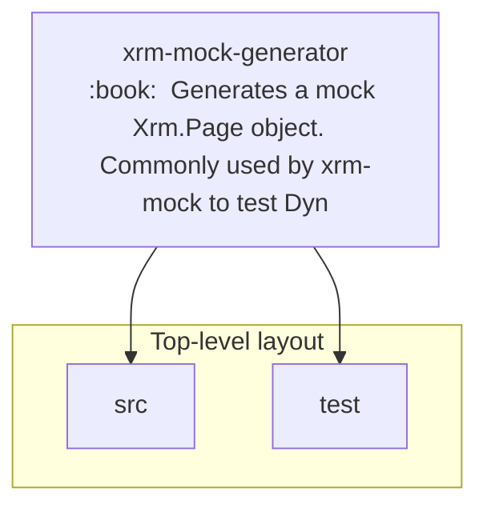
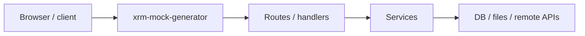

# xrm-mock-generator architecture

[WycliffeAssociates/xrm-mock-generator](https://github.com/WycliffeAssociates/xrm-mock-generator) — :book:  Generates a mock Xrm.Page object.  Commonly used by xrm-mock to test Dynamics 365 client-side customisations..

Generates a mock Xrm.Page object.

## System context

## Repository structure

**Directories:** `src`, `test`

**Notable files:** `.gitattributes`, `.gitignore`, `.npmignore`, `package-lock.json`, `package.json`, `README.md`, `wallaby.js`

## Runtime / integration sketch

> This diagram is inferred from repository layout, languages, and README. It is a starting map, not a full design review.

## Languages

| Language | Approx. file count |
|----------|-------------------|
| JavaScript | 9 files |

## Design notes

| Topic | Detail |
|--------|--------|
| **Stack** | Node.js |
| **Default branch** | `master` |
| **Org** | WycliffeAssociates |

## Related

- Source: [WycliffeAssociates/xrm-mock-generator](https://github.com/WycliffeAssociates/xrm-mock-generator)
- Branch analyzed: `master`
